# PROJECT GRAHAM CRACKER
*Breaking Data into Digestible Pieces*

---

By: Pavi Gupta, Liana Kim, Sae-Jin Moon, Anh Phan, Daniel Son, Esther Yun

---

## Executive Summary 
A CSV (comma-separated values) file is a plain text file that stores tables of data and organizes with rows and columns. These files are important in the world of data because they are simple, universally compatible, and easy to store, transfer, and share. However, these files often contain a jumble of unorganized data that makes it hard to analyze and understand.  
 
Through Project GRAHAM Cracker, we hope to help data scientists clean up their files. Users will have the ability to upload their file and pick parameters that they want their data to be organized by. For example, they can select an option for the data to be organized to remove any duplicate cells. They will then be able to download the organized file in a variety of formats to use and analyze in any way they see fit. The frontend is very accessible and easy to understand, allowing anyone from a beginner coder to a seasoned data scientist to customize and organize their data.

## System Overview 
Some concepts and tools we used includes:
- GitHub, CSVkit, importing CSV files (from Case 3) 
- Creating an app.py, flask, and API (from Case 4) 
- Building a front end and back end (from Case 7) 

## Architecture
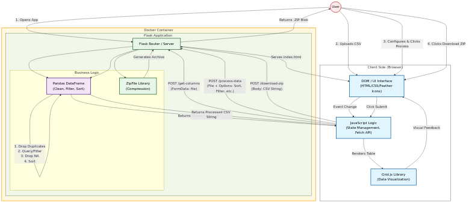

## How to Run 
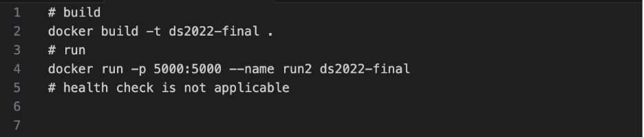

## Design Decisions
As data scientists, we have experienced working with CSV files first-hand, and felt the frustrations of disorganized headers, empty cells, and undecipherable data. We felt that this would be a useful tool for anyone working with CSV files, regardless of their field or type of data that they are working with. Some alternative ideas that we considered were a cloud storage application to manage personal media and an OCR application to transcribe handwritten notes to a digital document. 

We do not limit the number of requests to our backend, so there is the possibility of it crashing from too many requests. Additionally, we could be prone to XSS (cross-site scripting) attacks or hacking. There is no tangible cost to maintaining this program, however, if we wanted to make it more secure and add even more features, it would take more time and effort to execute and maintain. We do not collect any personal data of the user. While the uploaded CSV file does temporarily get saved in RAM, it never gets saved on our end. One possible limitation for us to investigate in the future would be to understand the size limit for the file upload. We were able to make many successful runs with a variety of CSV files, but we have yet to find the maximum size a file can be before it can no longer be accepted. 

## Results and Evaluation
<ins>What the front end looks like from the user’s perspective</ins>
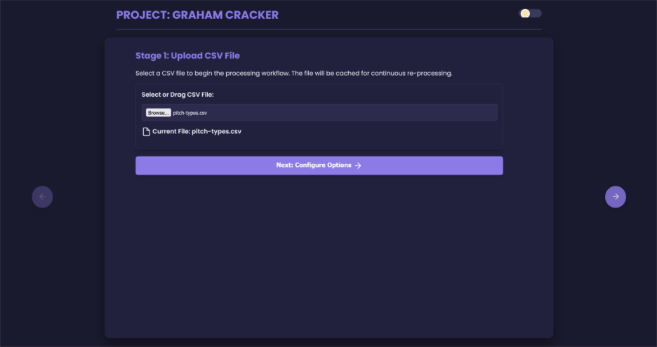
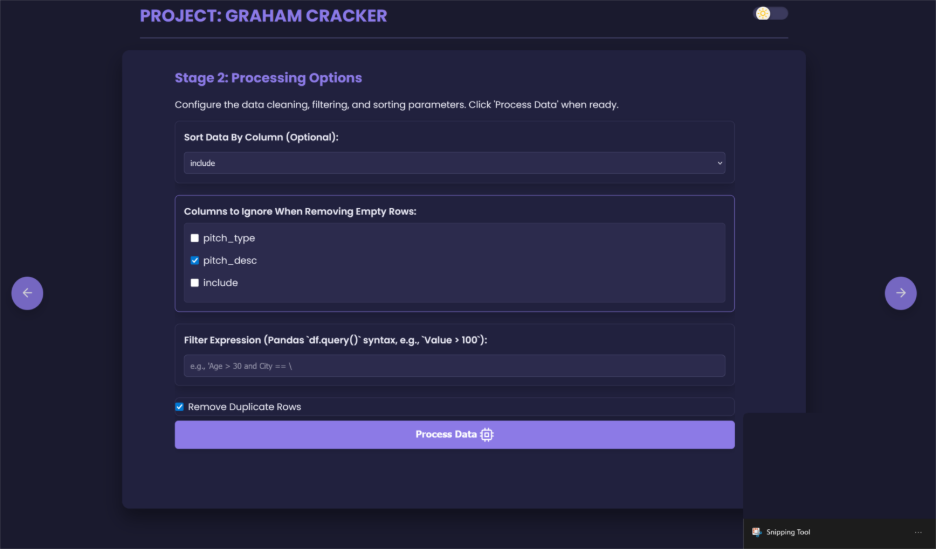
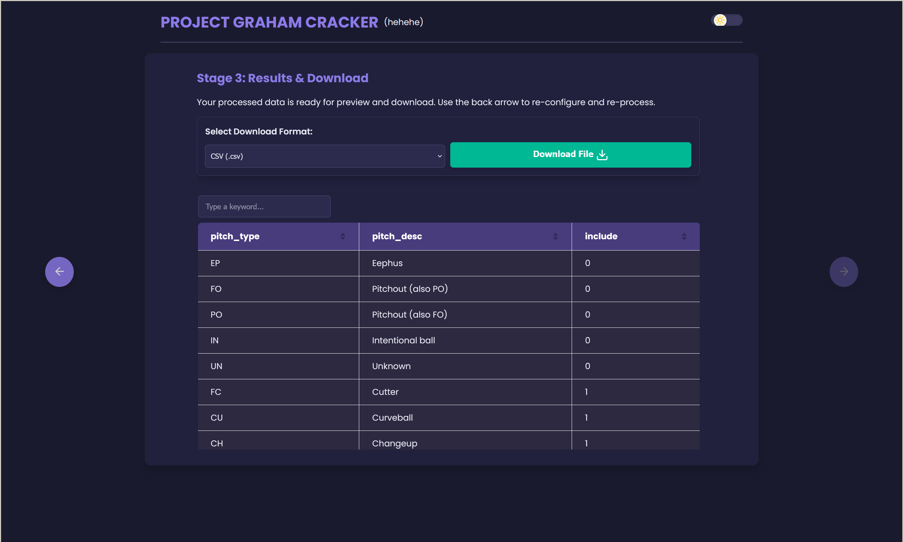
 
<ins>Feature: Selecting columns in the CSV to ignore</ins>
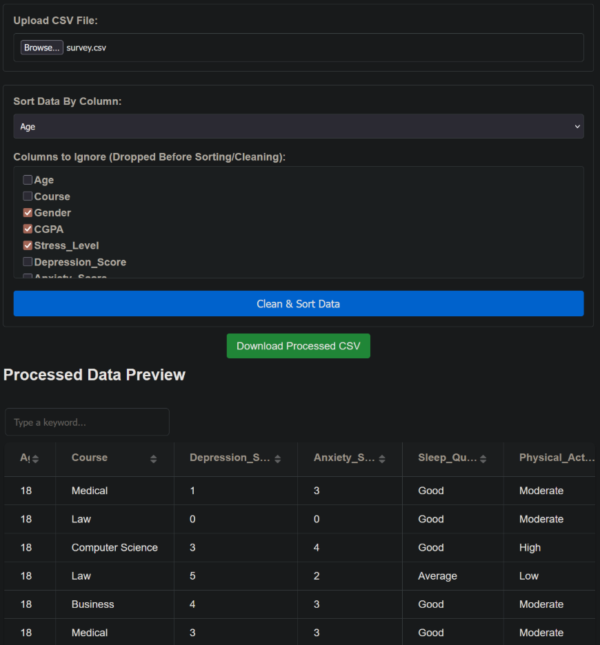
 
<ins>Feature: Select a column to sort the data by</ins>
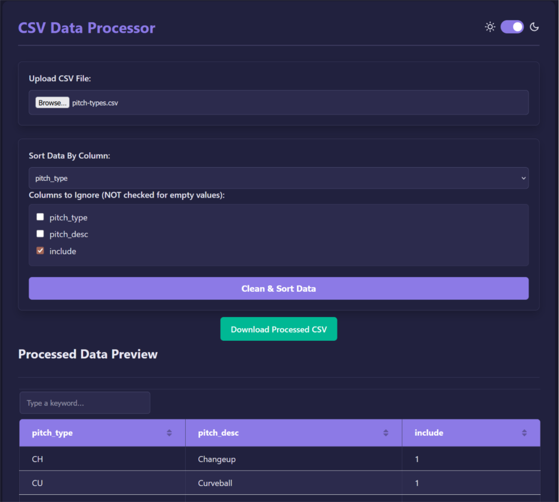
 
<ins>Feature: Filter expression</ins>
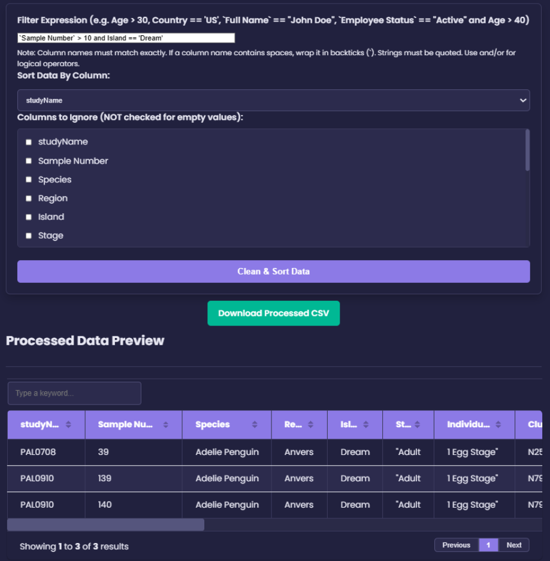
 
<ins>Feature: Removing duplicate rows</ins>
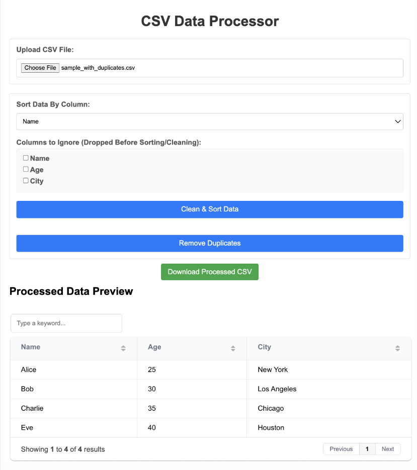
 
<ins>Feature: Allowing user to download a compressed version of the CSV file</ins>
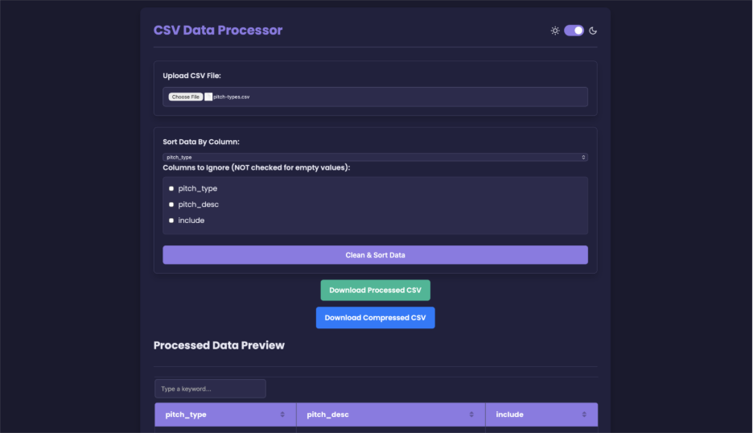
 
<ins>Feature: Download the file in different formats.</ins>
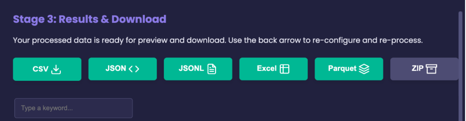

## What's Next
In the future, we can improve this by adding more features for the user to access. Some of these features include: 
- Changing language and grammar in the data to be more legible without changing the meaning of it. 
- Standardizing capitalization across the cells (ex. Headers and titles become uppercase and cells are lowercase) 
- Profiling the columns: Printing out the different types of data, how many cells are empty, etc. 
- Stretch features: Allowing the user to upload more types of files than just CSV files, allow the user to create an account that stores all the files that they have uploaded for their storage.

Code refactors:
- Caching some values input by the user so they do not need to select their preferences repeatedly every time they refresh their page. This will lead to a more seamless, improved user experience.  
- Making major aesthetic changes to make it more uniform, improve light/dark mode settings, and increase accessibility for color blind users.  

## Links
**Github**: [Project Repository](https://www.github.com/saejin-moon/ds2022-final)
